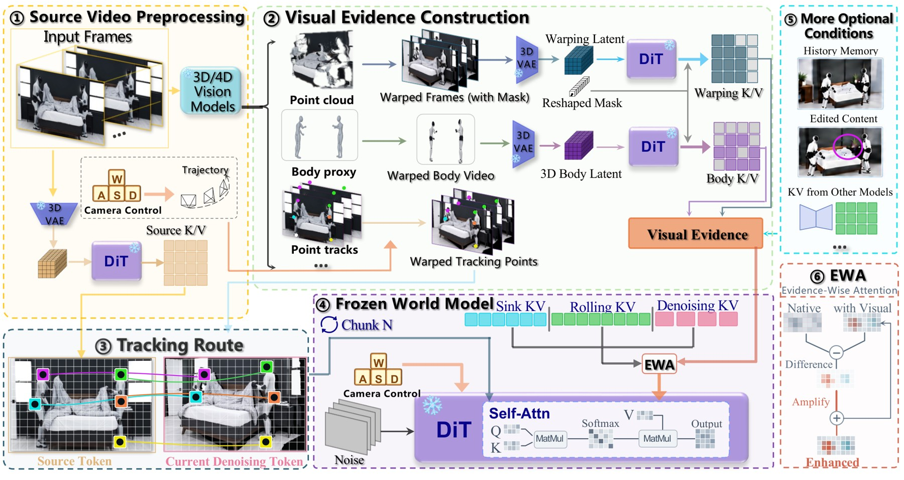

# World in World

<div align="center">

[](#)&nbsp;
[](https://chenxi-song.github.io/worldinworld/)&nbsp;

</div>

## Update
- [2026.09] 🔥 **Code released!** Free-camera re-cinematography, bullet time and video editing on real videos.
- [2026.09] [Project page](https://chenxi-song.github.io/worldinworld/) is online.

## Introduction

**World in World** lets a frozen video world model ([LingBot-World 2.0](https://github.com/Robbyant/lingbot-world-v2), 14B) walk into an ordinary video: give it a new camera path and it re-films the same event from the new viewpoints — no training, no fine-tuning, one 80 GB GPU.

<div align="center">

</div>

Everything we want to control (the source video, its geometry, the camera) is turned into *visual evidence*: the source frames are lifted with depth, warped into the new camera and handed to the model as extra keys/values of its own attention, so the model sees what the new camera should see and paints the rest itself. Details are in the [paper](#) and on the [project page](https://chenxi-song.github.io/worldinworld/).

<details>
<summary><b>What's released</b></summary>

The warping-based part of World in World: **free-camera re-cinematography** (replay a video along any new camera path — arcs, orbits, pans, in-place rotations, free exploration), **bullet time** (freeze the action at any frame and move the camera around the frozen moment) and **video editing** (edit the first frame, the edit follows through the whole clip, optionally with a new camera). These are the code and default settings behind the corresponding results on the project page; the remaining parts of the paper are listed in the [roadmap](#roadmap) below.

</details>

## Roadmap
- [x] Free-camera re-cinematography
- [x] Bullet time
- [x] Video editing
- [ ] Large-angle human re-shooting with the 3D body proxy
- [ ] Cross-model memory sharing
- [ ] Frustum memory for long videos
- [ ] Streaming / interactive generation
- [ ] Multi-view keyframe generation and motion transfer

## Installation

Tested on Linux with an 80 GB A100 (peak memory ~72 GB), CUDA 12.4, Python 3.10.

```bash
git clone <this repository> worldinworld && cd worldinworld
conda create -n wiw python=3.10 -y && conda activate wiw

# PyTorch 2.6 (cu124), then everything else
pip install torch==2.6.0 torchvision==0.21.0 --index-url https://download.pytorch.org/whl/cu124
pip install -r requirements.txt

# flash-attn: use the pre-built wheel for torch 2.6 / cu12 / cp310 (building from source is slow and fragile)
pip install https://github.com/Dao-AILab/flash-attention/releases/download/v2.7.4.post1/flash_attn-2.7.4.post1+cu12torch2.6cxx11abiFALSE-cp310-cp310-linux_x86_64.whl
```

Model weights (~86 GB; downloads resume if interrupted; add `--mirror` to go through hf-mirror.com):

```bash
python tools/download_weights.py --only lingbot          # base model — enough for the bundled examples
python tools/download_weights.py --only lingbot,vda      # + Video-Depth-Anything, for your own videos
```

For your own videos the depth model is used as plain Python code:

```bash
git clone https://github.com/DepthAnything/Video-Depth-Anything.git third_party/Video-Depth-Anything
```

Weights and repositories can live anywhere — see the environment variables at the top of `wiw/config.py`.

## Run the examples

Two examples come with their source video, depth and prompt embeddings, so they run with only the base model:

```bash
# bullet time: the ball freezes in the air for 5 s while the camera sweeps a 150° arc around it
python tools/run_example.py examples/tennis_bullet_time

# re-cinematography: a static shot is replayed with large in-place camera rotations (-70° / +40° / -70°)
python tools/run_example.py examples/robot_bedroom_rotation
```

Results land in `workspace/tennis_bt/out/tennis_bt_arc75.mp4` and `workspace/robot_bedroom/out/robot_bedroom_rot70.mp4`. Next to each video a folder with the same name holds what the model was shown: `*_input.mp4` (the warped source), `*_mask.mp4` (how much each token was trusted) and `*_meta.json`. Loading the 14B model takes 5–20 minutes depending on your disk; the generation itself takes about 5 minutes (15 chunks of 16 frames).

Every example is a `config.json` (video, prompts, camera path) — copy one and change the numbers to get a different shot, e.g. `"window": ["45-124:orbit360"]` for a full orbit during the freeze, or `"motion": "arc:amp=60"` for a ±60° arc over the whole clip. `python tools/run_example.py <example> --from_scratch` recomputes the depth instead of using the bundled one.

## Your own video

The whole chain is four commands. Frames are cover-resized to 832×464 and the clip is trimmed to a multiple of 16 frames (+5); clips of 5–15 s work well — cut longer videos with `--start` / `--max_frames`.

```bash
# 1. frames, VAE latents and prompt embeddings
python -m wiw.prep --video clip.mp4 --case mycase \
    --prompt "<what the clip shows, subjects included>" \
    --scene_prompt "<the scene only, no people / animals / moving objects>"
# 2. depth
python -m wiw.depth --case mycase
# 3. a camera path (--pivot auto puts the subject at the centre of the motion)
python -m wiw.traj --case mycase --name arc60 --motion arc:amp=60 --pivot auto:0
# 4. generate: chunk 0 uses the full prompt, later chunks the scene prompt
python -m wiw.generate --case mycase --traj arc60 --prompt_schedule 1-9:scene
```

Camera paths: `--motion` takes `arc:amp=60`, `orbit360`, `ring:r_ratio=0.3`, `rot:amp=45` (in-place rotation), `fwdback`, `truck`, `combo`, `canonical:action=pan_left,magnitude=30`, …; `--yaw_plan` scripts an in-place rotation frame by frame; `--explore` takes a keyframe list; any `poses.npy` (camera-to-world, OpenCV, first pose = identity) can be dropped into `workspace/mycase/traj_<name>/` as well. Run `python -m wiw.traj -h` for the full list.

Bullet time — freeze frame 45 for 80 frames, move the camera inside the frozen window, and use a "frozen" prompt for the chunks that cover it:

```bash
python -m wiw.bullet --case mycase --out mycase_bt --freeze 45:80
python -m wiw.traj --case mycase_bt --name arc75 --pivot auto:45 --window 45-124:arc:amp=75
python -m wiw.generate --case mycase_bt --traj arc75 --prompt_schedule 3-7:scene
```

Video editing — edit the first frame with any image editor, provide per-frame masks of the edited region (e.g. from SAM2/SAM3 video propagation, or a single mask for static regions), then:

```bash
python -m wiw.edit --case mycase --name red_dress --frame0 edited_frame0.png --mask masks/ --prompt "<edited video>"
python -m wiw.generate --case mycase --traj static --edit red_dress              # keep the camera
python -m wiw.generate --case mycase --traj arc45  --edit red_dress --edit_recam # edit + new camera
```

Correspondence-guided attention (optional, off by default) — links every generated token to the source token that shows the same physical point at the same moment; it helps most on fast, articulated motion. It needs dense point tracks from [CoWTracker](https://github.com/facebookresearch/cowtracker), which take roughly a minute per 16 frames on an A100 (~15–20 min for a 15 s clip):

```bash
git clone --recurse-submodules https://github.com/facebookresearch/cowtracker.git third_party/CoWTracker
python tools/download_weights.py --only cow
python -m wiw.track --case mycase                       # writes mycase/tracks.npz (redo it for a bullet-time case)
python -m wiw.generate --case mycase --traj arc60 --prompt_schedule 1-9:scene --cgar
```

For the bundled examples `python tools/run_example.py <example> --cgar` does the same.

Two things that matter in practice: keep people and moving objects out of the scene prompt (once the camera looks away, the text prior likes to invent extra subjects), and use `--srccam` with a `srccam.npz` (per-frame camera-to-world of the source) when the source video was shot with a moving camera. `python -m wiw.generate -h` lists the remaining knobs (evidence steps, amplification weight, seed).

## Acknowledgments

World in World is built on [LingBot-World 2.0](https://github.com/Robbyant/lingbot-world-v2) and uses [Video-Depth-Anything](https://github.com/DepthAnything/Video-Depth-Anything) for depth and [CoWTracker](https://github.com/facebookresearch/cowtracker) for point tracks. The occlusion handling of the warp follows [UniWorld-View](https://arxiv.org/abs/2608.04701); thanks also to [WorldForge](https://github.com/Westlake-AGI-Lab/WorldForge), [ReCamMaster](https://github.com/KwaiVGI/ReCamMaster) and [TrajectoryCrafter](https://trajectorycrafter.github.io/) for inspiring discussions and baselines.

This repository is released under CC BY-NC-SA 4.0 (the license of LingBot-World 2.0); the third-party weights keep their own licenses.

## Citation

```bibtex
@article{song2026worldinworld,
  title   = {World in World: Explore the World with World Models},
  author  = {Song, Chenxi and Yang, Yanming and Zhang, Chi},
  journal = {arXiv preprint},
  year    = {2026}
}
```

## Contact

Questions and discussions are welcome — open an issue or write to Chenxi Song (songchenxi@westlake.edu.cn).
